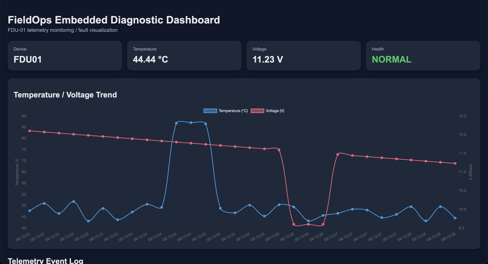
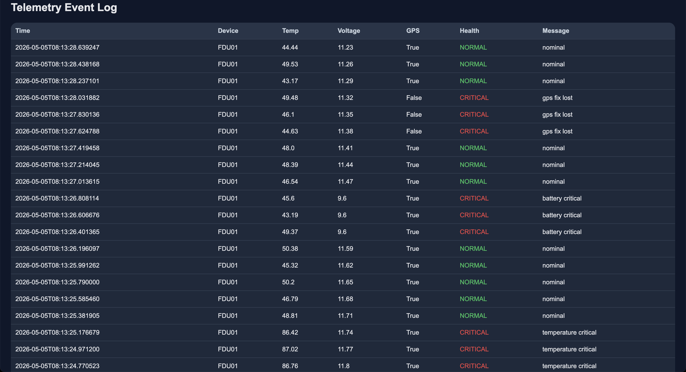
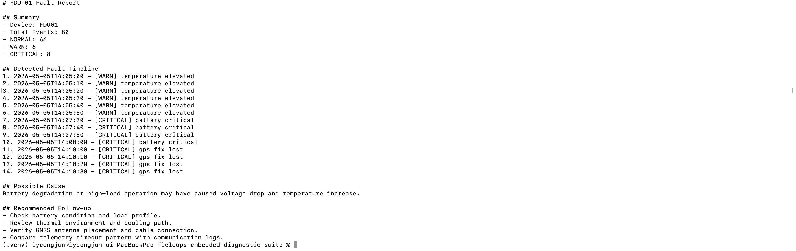
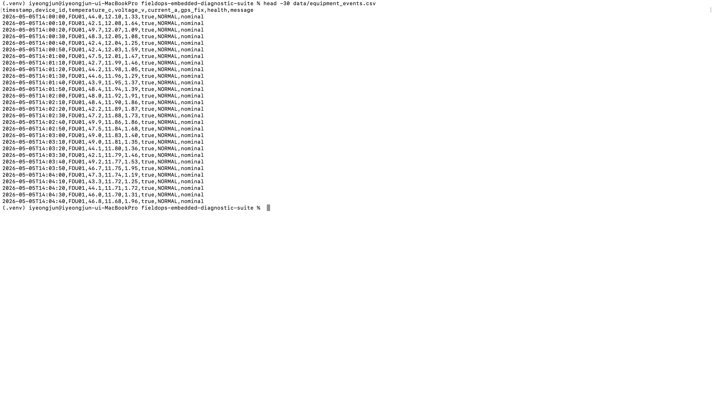

# FieldOps Embedded Diagnostic Suite

Embedded diagnostic pipeline portfolio project designed to simulate how field equipment telemetry can be collected, transmitted, monitored, and analyzed.

This project focuses on telemetry ingestion, UART-style parsing, UDP transmission, monitoring workflows, and fault analysis for operational environments.

---

## Key Technologies

`C` `Python` `UDP` `UART`
`Telemetry` `Monitoring`
`Diagnostics` `Logging`

---

## Quick Start

```bash
pip install -r requirements.txt

python3 scripts/generate_sample_data.py

python3 06_web_dashboard/dashboard.py
```

Open:

```text
http://localhost:8000
```

---

## Repository Structure

```text
01_serial_sensor_gateway/      UART-style parsing and gateway
02_gnss_position_tracker/      GNSS telemetry parsing
03_field_telemetry_monitor/    Telemetry monitoring pipeline
04_embedded_task_scheduler/    Embedded scheduler example in C
05_equipment_log_analyzer/     Fault-event analysis tooling
06_web_dashboard/              Monitoring dashboard
docs/                          System and interview documents
data/                          Sample telemetry datasets
```

---

## Runtime Example

```bash
python3 06_web_dashboard/dashboard.py
```

```bash
python3 05_equipment_log_analyzer/analyzer.py \
  --input data/equipment_events.csv \
  --report report.txt
```
---
## Architecture

```text
[Embedded Device Simulator]
    sensor data generation
        ↓
[UART-style Parser]
    packet parsing / validation
        ↓
[UDP Telemetry Sender]
    operational telemetry transmission
        ↓
[Monitoring / Logging Layer]
    CSV logs / event records
        ↓
[Dashboard / Analysis Tools]
    fault analysis / monitoring view
```

---

## Why This Project Exists

This project was built to study how embedded field devices can interact with operational monitoring systems.

The focus areas include:

- telemetry generation
- UART-style communication flow
- UDP telemetry delivery
- operational logging
- fault-event analysis
- monitoring-oriented system design

---

## Engineering-Oriented Features

This project includes:

- simulated embedded telemetry generation
- UART-style packet parsing
- UDP telemetry transmission
- structured logging
- operational fault records
- CSV export workflow
- monitoring-oriented architecture
- separation between telemetry and analysis layer

---

## Project Goals

The goal is not to build a production-certified industrial platform.

Instead, this project focuses on understanding:

- how field telemetry flows through systems
- how monitoring pipelines are structured
- how fault events can be logged and analyzed
- how embedded-style communication integrates with operational tooling

---

## Key Documents

| Document | Purpose |
|---|---|
| `docs/PROJECT_OVERVIEW.md` | High-level system overview |
| `docs/RUNBOOK.md` | Basic run and verification flow |
| `docs/LIMITATIONS.md` | Current limitations and future improvements |

---

## Sample Operational Log

```text
[INFO] Device connected
[INFO] Telemetry stream active
[WARN] Temperature threshold exceeded
[ERROR] Sensor timeout detected
[INFO] Recovery completed
```

---

## Example Workflow

```text
1. Device generates telemetry
2. Parser validates incoming data
3. UDP layer forwards telemetry
4. Monitoring layer records events
5. Fault analysis reviews abnormal behavior
```

---

## Screenshots

### Monitoring Dashboard





### Fault Analysis Report



### Raw Equipment Log



---

## Honest Limits

This project does **not** claim:

- production-grade industrial certification
- real hardware deployment
- secure telemetry infrastructure
- formal real-time guarantees
- hardware-in-the-loop testing

This is a portfolio and learning-oriented project focused on telemetry flow, monitoring structure, and operational diagnostics.

---

## Future Improvements

- Connect real MCU or sensor hardware
- Add packet integrity verification
- Add replay and load-test tooling
- Add dashboard screenshots and execution GIFs
- Add automated integration tests
- Add persistent database storage
- Add fault classification logic

---

## Interview Summary

> This project was built to study how telemetry and monitoring systems can be structured around embedded-style operational workflows: telemetry generation, parsing, UDP delivery, logging, and fault analysis.
